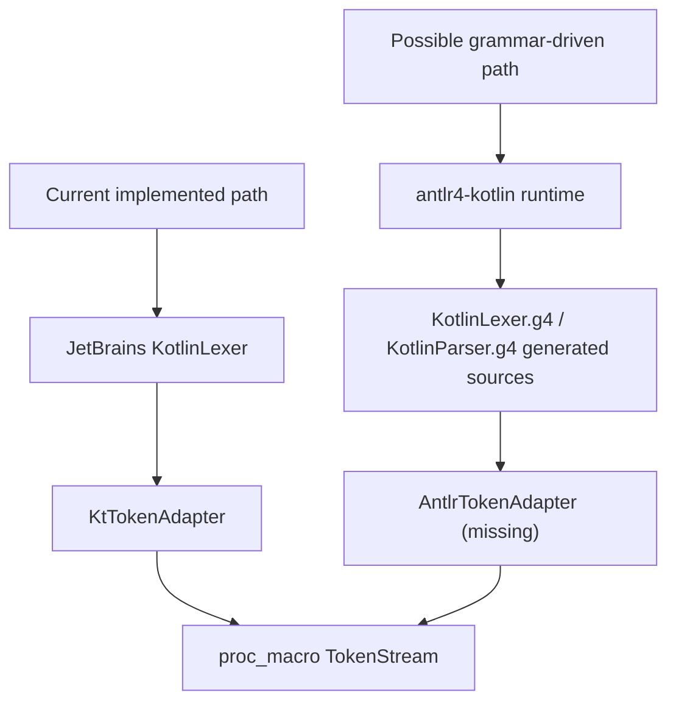
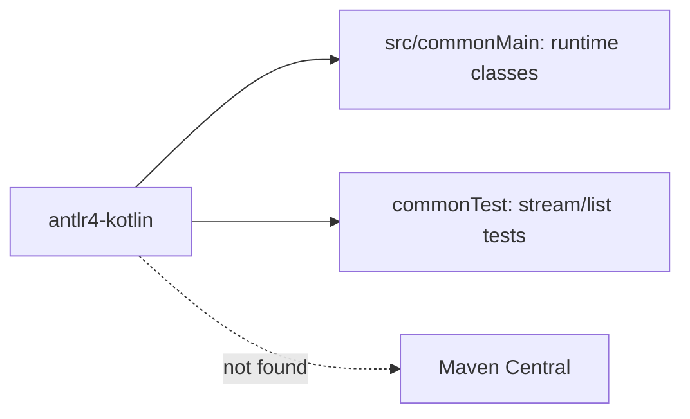
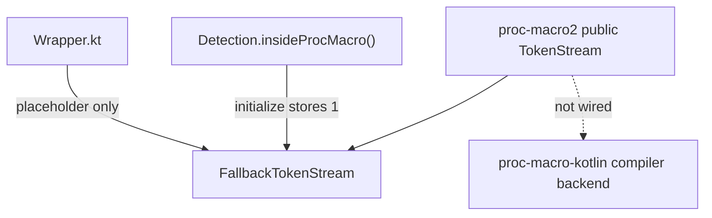
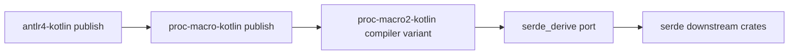
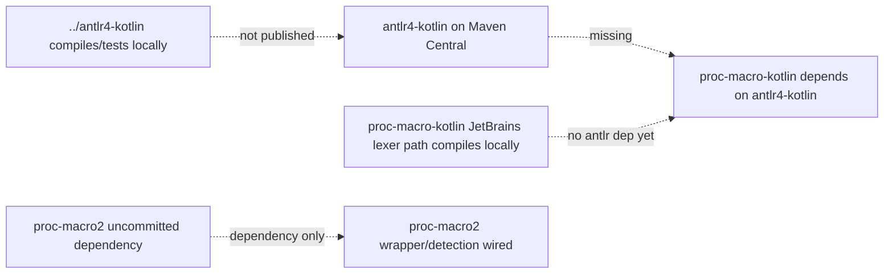
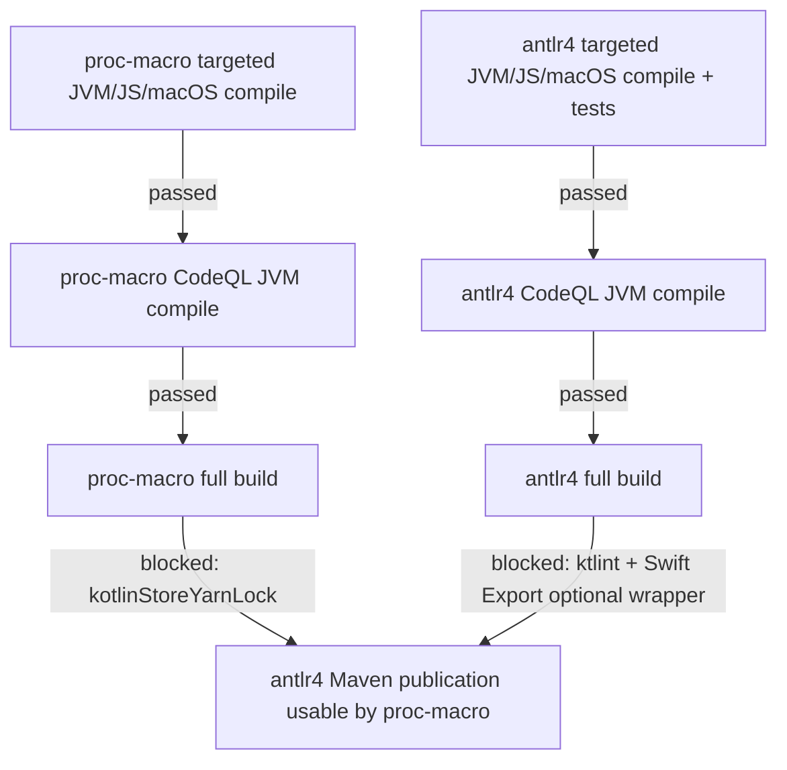

# JOURNAL.md

Research notes for `proc-macro-kotlin`. This file records observed state from
the current worktrees and commands, not desired state.

## 2026-06-03 audit

### Scope

Objective for this pass:

- Compare `PROJECT_PLAN.md` with current `proc-macro-kotlin` code.
- Check what is implemented, what is not implemented, and what needs to be
  wired.
- Inspect sibling `../antlr4-kotlin`, because that runtime is instrumental to
  the grammar-driven parser path and may not be published.
- Inspect sibling `../proc-macro2-kotlin`, because the next published value of
  this repo depends on wrapper/detection wiring there.
- Record findings with diagrams.

### Current branch/worktree observations

`proc-macro-kotlin`:

- Branch: `solaceproject/fix-js-codeql-output-generation`.
- Worktree had a pre-existing `build.gradle.kts` modification before this
  journal was added.
- That modification enables Swift export coroutine support and disables
  `allWarningsAsErrors` for tasks named `compileSwiftExport*`.
- This is relevant because the template policy has generally treated
  warnings-as-errors relaxation as CodeQL-only.

Sibling `../antlr4-kotlin`:

- Branch: `automation/fix-android-build-gates`.
- `PROJECT_PLAN.md` says `build.gradle.kts` and workflows are generated
  material copied from `proc-macro-kotlin`.
- Source layout currently has 180 `commonMain` Kotlin files and zero Kotlin
  files in `jvmMain`, `jsMain`, `nativeMain`, `wasmJsMain`, `wasmWasiMain`,
  and `androidMain`.

Sibling `../proc-macro2-kotlin`:

- Branch: `automation/compiler-variant-wiring`.
- Dirty files observed: modified `build.gradle.kts`, untracked
  `.codex/environments/environment.toml`.
- `build.gradle.kts` has an uncommitted dependency on
  `io.github.kotlinmania:proc-macro-kotlin:0.1.0`.

### Plan status: stale vs current evidence

`PROJECT_PLAN.md` in this repo starts with:

> Phase 2d -- antlr4-runtime KMP compilation fix. 804 errors remain before
> publish.

That headline is stale against the current sibling state. In
`../antlr4-kotlin`, the following targeted commands passed locally:

```bash
./gradlew --no-daemon compileKotlinJvm compileKotlinJs compileKotlinMacosArm64 --no-configuration-cache
./gradlew --no-daemon jvmTest jsNodeTest macosArm64Test --no-configuration-cache
./gradlew --no-daemon codeqlCompileJvm -Pkotlinmania.codeql=true --no-configuration-cache
```

What remains true:

- `antlr4-kotlin` is not published to Maven Central.
- Maven Central checks found no artifact:
  - `https://repo1.maven.org/maven2/io/github/kotlinmania/antlr4-kotlin/maven-metadata.xml`
    returned 404.
  - Maven Search for group `io.github.kotlinmania`, artifact
    `antlr4-kotlin` returned `numFound: 0`.
- `proc-macro-kotlin` does not currently declare or import
  `antlr4-kotlin`.
- `../proc-macro2-kotlin` is not wired beyond an uncommitted dependency.

### Implemented in proc-macro-kotlin

The phase-1 Rust-shaped proc-macro surface is present under
`src/commonMain/kotlin/io/github/kotlinmania/procmacro`:

- `TokenStream`
- `TokenTree`
- `Group`
- `Ident`
- `Punct`
- `Literal`
- `Span`
- `Delimiter`
- `Spacing`
- `LexError`
- `Diagnostic`
- `ToTokens`
- `Quote`
- `tokenstream/IntoIter`

The JetBrains KMP lexer path is implemented:


Evidence:

- `TokenStream.fromString(src)` constructs
  `org.jetbrains.kotlin.kmp.lexer.KotlinLexer()` and calls
  `KtTokenAdapter.tokenize`.
- `KtTokenAdapter` filters whitespace/comments, collapses string templates,
  groups delimiters, and converts Kotlin lexer tokens to
  `TokenTree.Group`, `TokenTree.Ident`, `TokenTree.Punct`, or
  `TokenTree.Literal`.
- Targeted proc-macro commands passed:

```bash
./gradlew --no-daemon compileKotlinJvm compileKotlinJs compileKotlinMacosArm64 --no-configuration-cache
./gradlew --no-daemon codeqlCompileJvm -Pkotlinmania.codeql=true --no-configuration-cache
```

### Not implemented or not wired in proc-macro-kotlin

There is no ANTLR path wired in this repo yet.

Evidence:

- `rg` found no `antlr4-kotlin` dependency in `build.gradle.kts`,
  `gradle.properties`, or `gradle/libs.versions.toml`.
- `rg` found no imports from `io.github.kotlinmania.antlr4` under `src`.
- There is no `AntlrTokenAdapter`.

The only source-token normalization path is:



The parser path from `PROJECT_PLAN.md` is not present in this repo yet.
The current implementation tokenizes Kotlin source into proc-macro-shaped
tokens but does not build a Kotlin parse tree or FIR/light tree.

### antlr4-kotlin status

`../antlr4-kotlin` has advanced beyond the old 804-error state. The runtime
has been moved into common source and targeted compile/test gates pass for
JVM, JS node, and macOS arm64.

Observed shape:



Important files observed:

- `src/commonMain/kotlin/io/github/kotlinmania/antlr4/CharStreams.kt`
- `src/commonMain/kotlin/io/github/kotlinmania/antlr4/CodePointBuffer.kt`
- `src/commonMain/kotlin/io/github/kotlinmania/antlr4/CodePointCharStream.kt`
- `src/commonMain/kotlin/io/github/kotlinmania/antlr4/Lexer.kt`
- `src/commonMain/kotlin/io/github/kotlinmania/antlr4/Parser.kt`
- `src/commonMain/kotlin/io/github/kotlinmania/antlr4/atn/ParserATNSimulator.kt`
- `src/commonMain/kotlin/io/github/kotlinmania/antlr4/misc/BitSet.kt`

Current publication facts:

- `gradle.properties` says `project.version=0.1.1`.
- `gradle.properties` says `project.name=antlr4-kotlin`.
- Maven Central does not currently expose `io.github.kotlinmania:antlr4-kotlin`.

This means proc-macro can only depend on it locally through composite build,
local Maven publication, or after a real Maven Central release.

### proc-macro2-kotlin wiring status

`../proc-macro2-kotlin` is the real next wiring point for the compiler
variant.

Observed current shape:



Evidence:

- `Detection.initialize()` still stores `works = 1`, which makes
  `insideProcMacro()` false.
- `Wrapper.kt` is a placeholder and still contains `port-lint: ignore`.
- `Lib.kt` public `TokenStream` stores `FallbackTokenStream` directly.
- `Lib.kt` public `Group` stores `FallbackGroup` directly.
- The uncommitted dependency line exists in `../proc-macro2-kotlin`:

```kotlin
implementation("io.github.kotlinmania:proc-macro-kotlin:0.1.0")
```

The dependency alone is not sufficient. The public types need wrapper
internals so they can hold either fallback values or proc-macro-kotlin values.

### Dependency and publish chain

Current intended chain from the two project plans:



Current observed chain:



### Concrete gaps

1. Update `PROJECT_PLAN.md` or at least treat its antlr4 804-error headline
   as stale. The current sibling runtime passes targeted compiles/tests.
2. Publish `antlr4-kotlin` or decide on a temporary local/composite dependency
   while wiring.
3. Decide whether `proc-macro-kotlin` needs ANTLR now. It currently works via
   the JetBrains lexer path and has no parser/ANTLR adapter.
4. If ANTLR is needed here, add a real dependency and implement an adapter:
   generated ANTLR token source -> `TokenTree` list -> `TokenStreamData`.
5. In `proc-macro2-kotlin`, replace the fallback-only public storage with a
   wrapper layer:
   - `WrapperTokenStream`
   - `WrapperSpan`
   - `WrapperGroup`
   - `WrapperIdent`
   - `WrapperPunct`
   - `WrapperLiteral`
   - `WrapperLexError`
6. In `proc-macro2-kotlin`, change detection only when the compiler path can
   actually construct and round-trip compiler-backed values. Setting
   `works = 2` before wrappers are real would only route callers into a
   missing backend.
7. Remove `port-lint: ignore` from `../proc-macro2-kotlin/Wrapper.kt` when
   editing that repo. The workspace guide says that directive is invalid.
8. Re-check the Swift-export `allWarningsAsErrors` relaxation currently dirty
   in this repo's `build.gradle.kts`; it may conflict with the CodeQL-only
   relaxation policy.

### Commands run in this audit

Proc-macro:

```bash
./gradlew --no-daemon compileKotlinJvm compileKotlinJs compileKotlinMacosArm64 --no-configuration-cache
./gradlew --no-daemon codeqlCompileJvm -Pkotlinmania.codeql=true --no-configuration-cache
```

ANTLR4 sibling:

```bash
./gradlew --no-daemon compileKotlinJvm compileKotlinJs compileKotlinMacosArm64 --no-configuration-cache
./gradlew --no-daemon jvmTest jsNodeTest macosArm64Test --no-configuration-cache
./gradlew --no-daemon codeqlCompileJvm -Pkotlinmania.codeql=true --no-configuration-cache
```

Publication checks:

```bash
curl -fsSL https://repo1.maven.org/maven2/io/github/kotlinmania/antlr4-kotlin/maven-metadata.xml
curl -fsSL 'https://search.maven.org/solrsearch/select?q=g:%22io.github.kotlinmania%22+AND+a:%22antlr4-kotlin%22&rows=20&wt=json'
```

Results:

- Proc-macro targeted compiles: passed.
- Proc-macro CodeQL JVM compile: passed.
- ANTLR4 targeted compiles: passed.
- ANTLR4 targeted JVM/JS/macOS tests: passed.
- ANTLR4 CodeQL JVM compile: passed.
- Maven metadata: 404 / search `numFound: 0`.

### Broad build follow-up

Proc-macro full build:

```bash
./gradlew --no-daemon build --no-configuration-cache
```

Result: failed at `:kotlinStoreYarnLock` with Gradle reporting that the
Kotlin JS lock file changed and should be actualized with
`kotlinUpgradeYarnLock`. The command did not leave a tracked lockfile diff in
this checkout; the only proc-macro dirty files after the run were the
pre-existing `build.gradle.kts` edit and this journal.

ANTLR4 sibling full build:

```bash
cd ../antlr4-kotlin
./gradlew --no-daemon build --no-configuration-cache
```

Result: failed after broad target tests had run. The useful failures are:

- `:ktlintKotlinScriptCheck` reported
  `build.gradle.kts:573:1 Unexpected indentation (16) (should be 12)`.
  The affected block is the `codeqlCompileJvm` task description:
  `"with kotlinc $codeqlLanguageVersion for CodeQL Java/Kotlin extraction."`
  is indented one level too far.
- `:swiftExportSmokeTest` failed because the nested
  `:macosArm64DebugSwiftExport` invocation failed inside Swift Export:
  `Found Optional wrapping for ... Bridge$AsOptionalWrapper ... unsupported.
  See KT-66875`.
- The same Swift Export run also emitted
  `No name for packageRoot and will be ignored` repeatedly before failure.

ANTLR4's worktree remained clean after the failed build. That means the
sibling runtime is no longer in the old "804 compilation errors" state, but
it is not publish-ready under the full build gate yet.

Gate status as of this audit:


